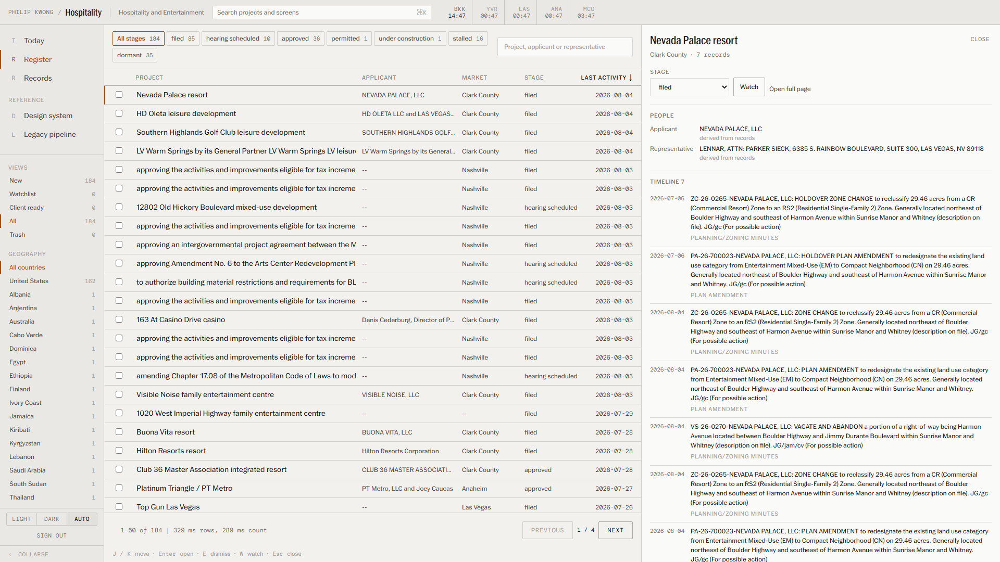
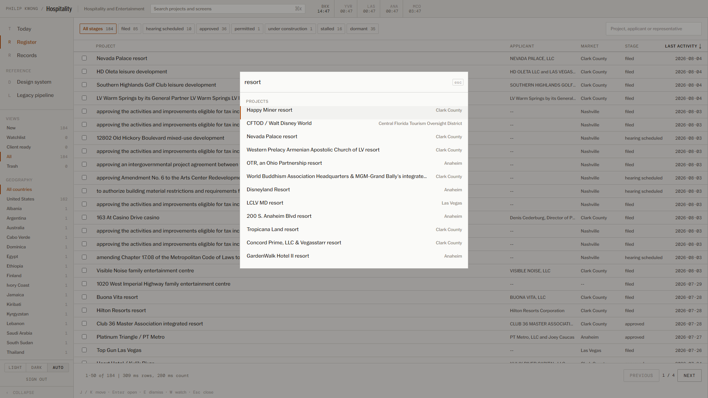
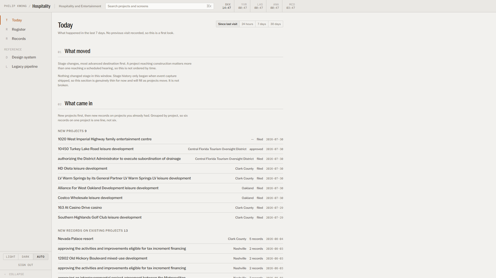
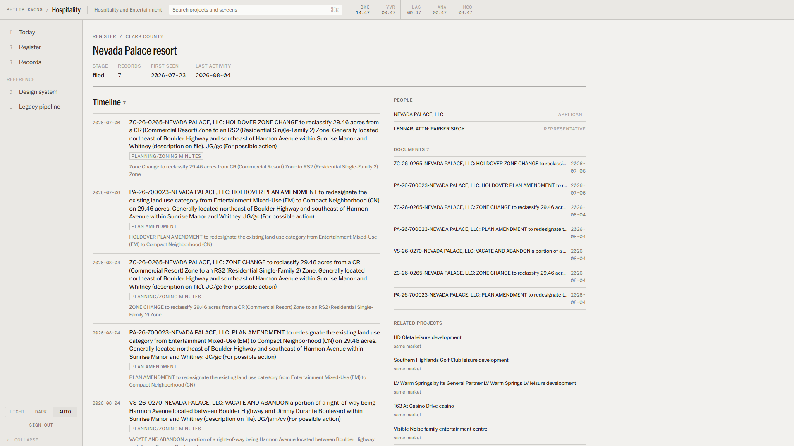
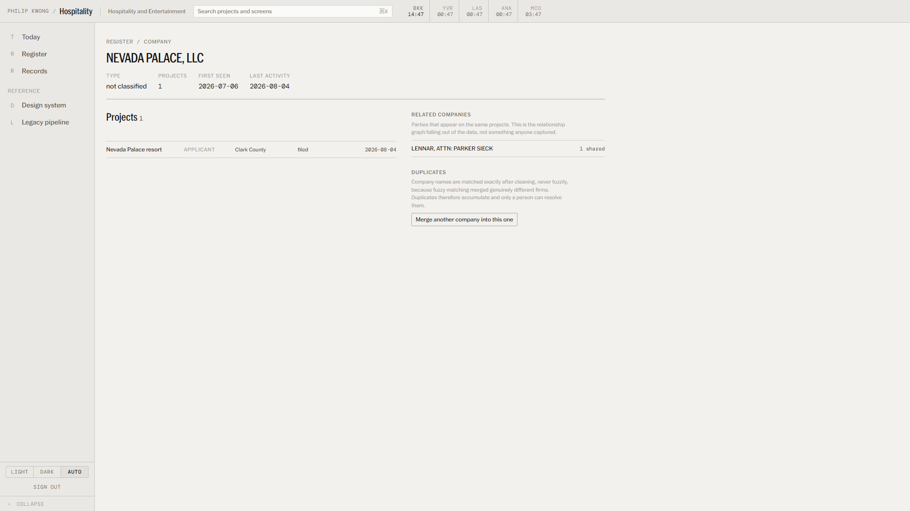

# The dashboard, explained

For someone who has never seen it. Every screen, every control, where the data
comes from, and what a person would actually do with it.

Screenshots referenced here are in `e2e/shots/walkthrough/`, captured at
1920x1080 in light mode against the live database. Regenerate them with
`npx playwright test --project=setup --project=walkthrough`.

---

## 1. What this product is

It watches public planning and procurement records across a set of hospitality
and entertainment markets, groups the individual records into **projects**, and
tells one person — Philip Kwong — what changed and what is worth acting on.

There are two levels of object, and almost every confusion about this interface
comes from mixing them up:

| Object | What it is | Where it lives |
|---|---|---|
| **Record** | One captured document: an agenda item, a tender notice, a filing. Immutable, has a source URL. | **Records** screen |
| **Project** | A cluster of records that are all about the same development. Has a stage, an applicant, a market, a history. | **Register**, **Project** page |

A project is built from records by the scraper. One project typically has 3–20
records. The Register is where you work; Records is where you check the raw
material.

There is a third object, **company**, which is any party named on a record
(applicant, representative, owner, presenter). Companies link projects together
and are the basis of the Company page.

### Where the data comes from

Everything is read from Supabase. Nothing in this dashboard scrapes anything;
the agents in `agents/` write these tables and the dashboard only reads them
(plus the handful of writes listed under "What you can change", below).

| Table | Holds | Written by |
|---|---|---|
| `leads` | Records. ~890 live rows for this pipeline. | scraper |
| `projects` | Projects. 184 rows. | scraper's clusterer |
| `project_events` | The event log: created, record attached, stage changed, party identified, and every manual change. 715 rows. | scraper + this dashboard |
| `companies` | Parties. 182 rows. | scraper |
| `company_projects` | Which company played which role on which project. 199 rows. | scraper |
| `agents` | Per-agent run status and last-run time. | scraper |
| `pipelines` | The pipeline registry: name, short name, client brand. | seeded |

---

## 2. How to read the interface

Five conventions do most of the work. Learning them once makes every screen
readable.

1. **Anything in a monospaced face is data.** Every number, date, count,
   identifier and timing is DM Mono. Everything else — labels, names, prose — is
   PP Neue York. This is the fastest way to tell a value from a label, and it is
   why the columns line up without gridlines.
2. **Orange means one thing per screen.** The accent marks the single most
   important thing in a view: the active navigation item, the selected row, the
   primary action. If you see two, something is wrong. This is enforced
   automatically — the capture run fails a screen that exceeds its accent budget.
3. **Nothing has rounded corners except buttons and inputs.** Cards, panels,
   rows and tables are square. If a corner is round, it is something you click
   or type into.
4. **Selection is an edge, never a fill.** A selected row gets a 2px orange bar
   on its left. Rows are never tinted, so a long list never becomes a colour
   chart.
5. **Red and green mean failure and health, and nothing else.** Stage is never
   colour-coded; it is carried by position and label. A red thing is genuinely
   wrong.

---

## 3. The shell

Present on every screen. Learned once, never moves.



### Top bar (48px)

| Control | What it does | Notes |
|---|---|---|
| **PHILIP KWONG / Hospitality** | Links to the Register. | Both halves are read from the `pipelines` table, not typed into the code. "Hospitality" is the pipeline's short name. |
| **Hospitality and Entertainment** | The active pipeline, in full. | Plain text today because there is exactly one active pipeline. It becomes a dropdown automatically the moment a second pipeline is marked active — no code change. |
| **Search projects and screens ⌘K** | Opens the command palette. | **It is a button, not a text field.** Clicking it or pressing Cmd/Ctrl+K opens the palette; you type there. |
| **World clock** | Local time in Bangkok, Vancouver, Las Vegas, Anaheim, Orlando. | A city in its working day (08:00–19:00 local) is shown in full ink; outside those hours it is grey. That is the only signal — it answers "can I call them now" at a glance. Vancouver, Las Vegas and Anaheim are all Pacific and so always read the same; they are listed separately on purpose, so you never have to remember which markets share a zone. |

### Left rail (200px, collapsible to 56px)

The top half never changes. The bottom half belongs to the current screen.

**Primary navigation** — Today, Register, Records.
**Reference** — Design system, Legacy pipeline.

At the foot: the theme control (**Light / Dark / Auto** — Auto follows your
operating system), **Sign out**, and **Collapse**. The collapsed state is
remembered across sessions. Sign-out and theme are deliberately down here rather
than in the top bar, so the top bar stays four things.

### Command palette (Cmd/Ctrl+K)



Three kinds of result, in this order:

- **Projects** — matched by name against the database as you type. This is the
  only practical way to reach a specific project among 184 (and eventually
  thousands).
- **Go to** — every screen in the rail.
- **Pipeline** — appears only when more than one pipeline is active.

Arrow keys move, Enter selects, Escape closes. Selecting a project opens it in
the Register with the detail pane already open.

### Keyboard

| Key | Where | Does |
|---|---|---|
| `Cmd/Ctrl+K` | anywhere | Open/close the command palette |
| `J` / `K` | Register | Move down / up the list |
| `Enter` | Register | Open the selected project's full page |
| `E` | Register | Dismiss the selected project (to Trash) |
| `W` | Register | Toggle the selected project on the watchlist |
| `Esc` | Register | Close the detail pane |

Keys are ignored while you are typing in a field.

---

## 4. Today



**What it is for:** the answer to "what happened while I was away", read top to
bottom in about ten seconds. It is the landing screen.

**Period selector** (top right): *Since last visit* (default), *24 hours*,
*7 days*, *30 days*. "Since last visit" is the real question, so it is the
default. The timestamp is captured when you arrive and written when you leave,
so the window stays still while you read it. On a first visit there is no stored
timestamp and it falls back to 7 days, and says so.

### 01 What moved

Stage changes in the period. Sourced from `project_events` where
`event_type = 'stage_changed'`. Ordered by **how advanced the destination stage
is**, not by time — a project reaching "under construction" matters more than one
reaching "hearing scheduled", and a time-ordered list buries it.

Each line: project name (orange, the only accent on this screen), old stage
struck through, new stage, market, the record that triggered it, and the date.

**This section is currently almost always empty, and says so.** Stage history
only began when event capture shipped; there is exactly **1** `stage_changed`
event in the database today. The empty state explains that rather than looking
broken. It will fill as projects move.

### 02 What came in

Two groups, both from `project_events`:

- **New projects** — `project_created` events in the window.
- **New records on existing projects** — `record_attached` events, **grouped by
  project**, so a project that gained six records is one line reading "6 records",
  not six lines. Records attached to a project that was itself created in the
  same window are excluded, because they are part of that project's arrival
  rather than separate news.

### 03 Needs you

Three cards, each a count and a destination. Clicking one lands on the right
screen **with the filter already applied**.

| Card | Counts | Goes to |
|---|---|---|
| Record triage backlog | `leads` still at status `new` (records, not projects) | Records |
| Watchlist activity | events in the window on projects you watch | Register, Watchlist view |
| New projects to review | projects created in the window | Register, New view |

### 04 Attention

About the machine, not the market.

- **Sources** — how long since each source last delivered anything, derived from
  the newest `first_seen` per `source` in `leads`. A source silent 7+ days is
  listed; 14+ days is shown in red. Under 7 days is normal operation (the
  multilateral tender feeds publish weekly) and is not flagged, so this section
  stays worth reading. If nothing is degraded it says so in green.
- **Runs** — agents whose `status` is `error` or that carry an error message.
- **Cost against ceiling** — **not instrumented.** There is no cost table in this
  database. The section says that plainly rather than showing a fabricated zero.

---

## 5. Register


**What it is for:** the working surface. This is where you triage projects,
filter them down, and decide what goes in a brief. It is three panes: filters on
the left, the list in the middle, the selected project on the right. Opening a
project never costs you your place in the list.

**It lists projects, not records.** For records, see the Records screen.

### Rail: Views

Each is a filter on the project's triage status, with a live count that equals
exactly what you get when you click it.

| View | Filters on |
|---|---|
| New | `status = 'new'` |
| Watchlist | `watch = true` and `status <> 'dismissed'` |
| Client ready | `status = 'client_ready'` |
| All | `status <> 'dismissed'` — the working set |
| Trash | `status = 'dismissed'` |

Nothing is ever deleted. Trash is a view, and a **Restore** button appears on
every row in it.

### Rail: Geography

A three-level tree — country → region/state → market — with a count at every
level. It is collapsed except along the branch you are in: regions appear once
you pick a country, markets once you pick a region. Clicking an already-selected
level deselects it. Counts exclude the geography filter itself, so a market
reading 17 gives you 17 rows.

### Rail: Saved views

Filter combinations worth one click: *None*, *Anaheim*, *Approved, anywhere*,
*Hearing scheduled*. Each sets several filters at once. (Two earlier entries were
removed because they did not actually change the result set — see §10.)

### List: stage chips

Above the list, one chip per stage plus **All stages**, each with a count.
Filters on `projects.stage`. Counts exclude the stage filter itself, so a chip
reading 85 gives you 85 rows.

Stages, in ladder order: filed → hearing scheduled → approved → permitted →
under construction, plus the off-ladder states stalled and dormant.

### List: search

Filters on three columns at once with a case-insensitive contains match:
`name`, `primary_applicant`, `primary_representative`. Debounced 250ms. That set
is deliberate: you look for a project by what it is called, who is building it,
or who is representing them.

### List: columns

Project, Applicant, Market, Stage, Last activity. Nothing else earns a column.
Click any header to sort; click again to reverse. The header carrying the sort is
shown in full ink with an arrow. **Sorting is done by the database, not in the
browser** — it reorders all 184 rows, not just the 50 on screen.

- The project name flexes and truncates; everything else is content-sized.
- Dates are mono and right-aligned.
- A small grey dot before a project name means it is on your watchlist.

### List: rows and selection

- **Click a row** — opens it in the detail pane and marks it with an orange left
  edge.
- **Checkbox** — multi-select. Selecting any row reveals a bulk bar with
  **Watch**, **Dismiss** (or **Restore** in Trash) and **Clear**.

### Pager

Reads `1-50 of 184 | 300 ms rows, 285 ms count`. Page size is fixed at 50. The
timings are the actual server round trips, printed so that "server-side paging"
is a number you can see rather than a claim.

### Detail pane

| Element | What it shows |
|---|---|
| Name, market, record count | Identity. |
| **Stage** dropdown | Changes the project's stage. Writes immediately and logs a `stage_changed` event. |
| **Watch** / **Watching** | Toggles the watchlist. Orange when on. Same as pressing `W`. |
| **Open full page** | The Project page (§6). |
| Manual-correction notice | Appears only if fields have been hand-corrected: "no future run overwrites these". |
| **People** | Applicant and representative, each labelled **derived from records** or **corrected**, so you always know whether you are looking at an inference or a human decision. |
| **Timeline** | Every attached record in date order, each with its source type and a link to the original document. |
| **Notes** | Free text. Save/Discard appear only once you have changed something. |

---

## 6. Project page



**What it is for:** deep work, and the last read before a brief goes to a client.
Reached by pressing Enter in the Register, clicking "Open full page", or from any
related-project link.

Header: breadcrumb, project name, then the facts — Stage, Records, First seen,
Last activity, Next milestone (if any), and a **Watching** badge if applicable.

Body is two columns:

**Left, 60% — Timeline.** Every record, in date order, with its full title, its
source type, and what action was sought. This is the evidence, and it is read in
sequence, which is why it gets an uninterrupted column.

**Right, 40% — reference,** consulted out of order:

- **People** — every party, with the role held. **Each name links to that
  company's page**, showing everything it has ever filed.
- **Documents** — the records that carry a document link.
- **Related projects** — the sleeper feature. Two signals, and each result is
  **labelled with which one applies**:
  - `shares <company>` — the same party appears on both projects. This is how a
    corridor play becomes visible.
  - `same market` — the honest stand-in for "adjacent site". This database stores
    a market, not a coordinate or a parcel, so true adjacency cannot be computed.
    The label says exactly what was checked. Shared-party results always sort
    above same-market ones.
- **Event history** — every logged event for this project, oldest first, with
  actor. Shows 8 with a "Show all" control. Says plainly when it is short because
  capture began part-way through the project's life.

---

## 7. Company page



**What it is for:** answering "who is this party, what else have they done, and
who do they work with". Reached by clicking any name in a People list.

Header: name, then Type, Projects, First seen, Last activity.

- **Projects** — every project this company appears on, **with the role held on
  each**. That column is the point: the same firm is an applicant on one project
  and a representative on another, and the difference is the story.
- **Related companies** — parties that appear on the same projects, with a count
  of how many they share. This is the relationship graph falling out of the data;
  nothing was captured to produce it. A developer who brings the same law firm to
  every hearing shows up here on their own.
- **Duplicates** — the manual merge control.

### The merge control

Company names are matched **exactly after cleaning, never fuzzily**, because
fuzzy matching was tested and merged genuinely different firms. Duplicates
therefore accumulate and only a person can resolve them.

**Merge another company into this one** → search by name → pick → confirm. On
confirm, the duplicate's projects move to this company and the duplicate stops
appearing in listings. **Nothing is deleted**: the merged record keeps its row,
stays readable by URL, and says which company it was merged into. The merge is
stored as a manual override, so no future scraper run undoes it.

---

## 8. The other screens

**Records** — the original record table, unchanged. Three streams (Opportunities,
Intelligence, Government) with their own filters, triage, exports and PDF report
generation. This is where record-level triage happens and where the export
buttons live. It was previously at `/gli`; that URL still redirects here.

**Design system** — every colour, type step, spacing value and component on one
page, in both light and dark. Reference for anyone extending the interface. The
swatch values are read from the live stylesheet at runtime, so this page cannot
drift from what actually ships.

**Legacy pipeline** — the retired fuel and consulting lanes, closed 2026-07-29.
Frozen data, kept readable. Nothing new arrives here.

---

## 9. Filtering audit

Every Register filter, applied through the real interface, with the count before
and after. Totals are read from the pager, which prints the database's exact
count — so these measure the server's answer, not a slice of it.

Baseline: **184 projects** (view = All).

| Filter | Filters on (server-side) | Before | After | Verdict |
|---|---|---:|---:|---|
| View: New | `status = 'new'` | 184 | **184** | correct, but see below |
| View: Watchlist | `watch = true AND status <> 'dismissed'` | 184 | 0 | works |
| View: Client ready | `status = 'client_ready'` | 184 | 0 | works |
| View: Trash | `status = 'dismissed'` | 184 | 0 | works |
| Stage chip: filed | `stage = 'filed'` | 184 | 85 | works |
| Stage chip: hearing scheduled | `stage = 'hearing scheduled'` | 184 | 10 | works |
| Stage chip: approved | `stage = 'approved'` | 184 | 36 | works |
| Geography: United States | `country =` | 184 | 162 | works |
| Geography: + California | `country = AND region_state =` | 184 | 20 | works |
| Geography: + Anaheim | `country = AND region_state = AND market =` | 184 | 17 | works |
| Search: "resort" | `ilike` over `name`, `primary_applicant`, `primary_representative` | 184 | 35 | works |
| Search: "zzzznomatch" | same three columns | 184 | 0 | works (proves the term is applied) |
| Saved view: Anaheim | country + region_state + market | 184 | 17 | works |
| Saved view: Approved, anywhere | `stage = 'approved'` | 184 | 36 | works |
| Saved view: Hearing scheduled | `stage = 'hearing scheduled'` | 184 | 10 | works |
| *Control:* sort by name | nothing — reorders only | 184 | 184 | correct (a sort that changed the count would be a filter) |

**Every filter is server-side.** All of them are applied in
`applyProjectFilters()` as PostgREST predicates against the `projects` table; the
browser never receives rows it then hides. Facet counts come from the
`project_facet_counts` RPC, with an equivalent client-side fallback if that
migration is not applied.

The stage counts sum to 184 exactly (85 + 36 + 35 + 16 + 10 + 1 + 1), matching a
direct database tally.

**The one row that does not move: View: New.** This is **not** a broken filter.
All 184 projects currently carry `status = 'new'` — no project has been triaged
yet — so "New" and "All" legitimately return the same set. Dismiss one project
and the two numbers separate immediately. Verified by direct query:
`status: {"new": 184}`, `watch: {"false": 184}`.

Reproduce with:

```
npx playwright test --project=setup --project=walkthrough
```

Raw results are written to `e2e/shots/walkthrough/filter-audit.json`.

---

## 10. Things that do not communicate well, and things that are missing

Stated plainly rather than buried.

### Fixed while writing this document

- **Today's "Needs you" cards linked with a `?triage=` parameter no screen
  reads.** They navigated to an unfiltered list, so the count appeared to be
  forgotten on arrival. They now use `?view=` and land filtered, and the record
  backlog correctly goes to Records rather than the Register.
- **Saved view "No stage yet" did nothing.** It reset the stage filter, which is
  what "All stages" already does. There is no "stage IS NULL" predicate in the
  query layer, so an unstaged filter is not expressible against this schema. The
  entry was removed rather than left looking functional.
- **Saved view "Watched, moving" promised more than it did.** It filtered only on
  watch; nothing about movement. Removed.

### Known gaps

- **There is no date filter on the Register.** The query layer supports one
  (`activeFrom`, filtering `last_activity >=`) but no control exposes it. Today
  has a period selector and Records has "Captured" windows; the Register has
  neither. This is the most obvious missing filter.
- **"Records" vs "Register" is a genuinely confusable pair of names.** They are
  different objects (§1) and the distinction is load-bearing, but the words are
  close. "Register" for projects and "Records" for documents is the clearest pair
  available without renaming the underlying concepts.
- **The Inbox is not reachable.** 469 live records sit attached to no project.
  Records has no unattached-only view and the Register cannot have one (it lists
  projects). This is a real gap, and Inbox is on the roadmap as its own screen.
- **"Stage" is scraper-inferred and is not always right.** The detail pane lets
  you correct it, and a correction is protected from future runs, but nothing on
  the list marks a stage as inferred-versus-confirmed.
- **Company "Type" reads "not classified" for every company.** The column exists
  and nothing populates it yet.
- **Related projects will show "same market" for large markets regardless of any
  real relationship.** It is capped at 12 and always sorted below shared-party
  matches, but in a dense market it is weak signal. It is labelled honestly so
  you can discount it.
- **Watchlist is empty**, so the Watchlist view and Today's watchlist activity
  both read 0. They are wired correctly; nothing has been watched yet.
- **The Records screen is a 268 kB bundle** because it imports the Excel and PDF
  libraries into the browser eagerly. It should load them only when an export is
  clicked.

---

## 11. What you can change from this dashboard

Everything else is read-only. Every write below is logged to `project_events`
with an actor, so there is an audit trail.

| Action | Where | Effect |
|---|---|---|
| Change stage | Register detail pane | Writes `projects.stage`, logs `stage_changed` |
| Watch / unwatch | Register (pane or `W`) | Writes `projects.watch` |
| Dismiss / restore | Register (`E`, bulk bar, Trash) | Writes `projects.status`. Never deletes. |
| Edit notes | Register detail pane | Writes `projects.notes` |
| Merge companies | Company page | Repoints `company_projects`, marks the duplicate merged. Never deletes. |
| Triage records, export, generate report | Records | Record status, XLSX, PDF |

No outreach is ever sent from this dashboard.
